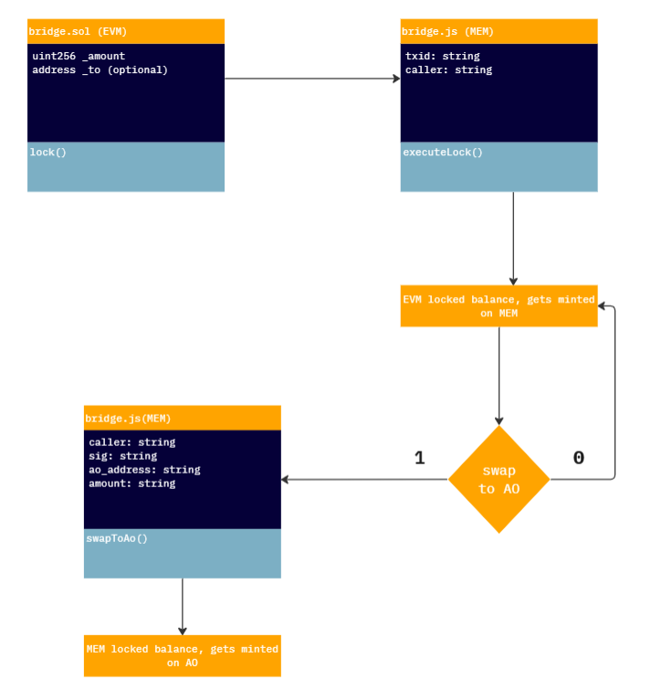
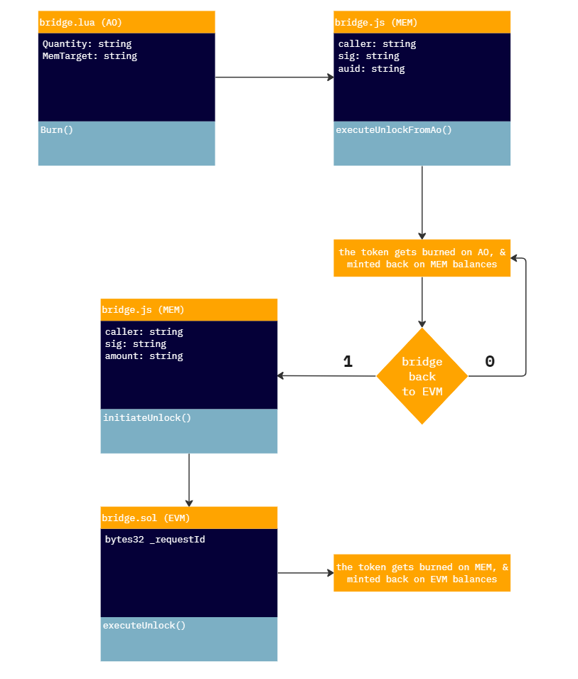

<p align="center">
  <a href="https://mem.tech">
    
  </a>
  <h3 align="center"><code>@mem-fdn/mem-bridge</code></h3>
  <p align="center">Bridging ERC20 Tokens to MEM Protocol</p>
</p>

## Abstract

This repository focuses on a design for a lock-mint ERC20 bridge to the MEM protocol. The bridge's tech stack utilizes MEM serverless functions, MEM molecules, EVM smart contracts, and Chainlink's AnyAPI.

***This is a experimental bridge, unaudited and not tested on mainnet, don't use it in production***

## Build and Run

```bash
git clone https://github.com/mem-fdn/mem-bridge.git

cd mem-bridge

npm install && npm run start
```

### To interact with MEM protocol

```bash
npm i -g mem-cli-js
```

And to deploy the `/contracts/mem` functions:

```bash
cd contracts

cd mem

mem deploy --src ./bridge.js --init-state bridge.json
```

## Changes Required for Testing

If you intend to modify and test the code yourself, please ensure to follow these steps:

1. Update the new `bridge.sol` contract address in the `/src/utils/constants.js` file.

2. Update the bridge address in the MEM function state (and redeploy it) located at `./contracts/mem/state.json`.

3. After redeploying the MEM changes, obtain a new function ID that you must update again in `/src/utils/constants.js`.

4. If you change the API endpoint, make sure to update it in the `./contracts/evm/bridge.sol` contract.

These modifications are essential to ensure that the API, which Chainlink interacts with, hosted under [0xmem.net](https://0xmem.net), accurately reads the token changes.

## Lock Flow



## Unlock Flow



## How It Works (Transaction Lifecycle for Bridging)

This section elucidates the transaction lifecycle of a lock-mint process:

1. **User Initiates Locking:** 
    - The user calls the `lock()` function from `bridge.sol`.

2. **Verification and Execution:**
    - Dapps retrieve the resulting TXID from step 1 and invoke the `executeLock()` function in the `bridge.js` serverless function.
    - This function verifies the data from the TXID of the lock function using the MEM molecule (`/vl/` server endpoint).

3. **Mirror of Token Balance:**
    - The `executeLock()` MEM function mirrors the token balance locked in `bridge.sol`, effectively bridging tokens to the MEM protocol.

4. **Initiating Unlock Process:**
    - To bridge tokens back to the EVM network, the user calls the `initiateUnlock()` function in `bridge.js`, providing a unique `caller` for authentication and assigning it to the `mid` or `memid` data property.
    - This function removes the caller's balance from circulation on the MEM side.

5. **Unlock Validation:**
    - The dapp retrieves the resulting `mid` from `./mem/bridge.json` and calls (a cronjob, admin function) the `validateUnlock()` function in `bridge.sol`.
    - This function utilizes Chainlink's AnyAPI node to read back from MEM function state, verifying the issued unlock status and authorized amount. It also verifies the `caller` with `msg.sender`.
    - Additionally, it maps the oracle request ID to `msg.sender` (`reqToCaller()`), the unique request ID to the unique `mid` (`reqToMemId`), and the `mid` to redeeming status (`midIsRedeemed`).

6. **Fulfillment by Chainlink Node:**
    - The Chainlink node invokes the `fulfill()` function to update the contract state variables (maps) with the authorized token unlock amount for the given `mid` or `memid` per caller (`msg.sender`).

7. **Execution of Unlock:**
    - The user retrieves the request ID from the TXID resulting from `validateUnlock()` and then calls `executeUnlock()` on the solidity contract.
    - The `executeUnlock()` function unlocks the token on EVM based on the validity of the initial `memid` per request ID.

### Note:

- The contract utilizes [LinkWell Nodes](https://linkwellnodes.io/) as the Chainlink oracle provider.
- The `constructor()` function is commented with initial values used for testing purposes.
- The bridge has been tested to bridge Sepolia USDC token ($USDC - `0x1c7D4B196Cb0C7B01d743Fbc6116a902379C7238`).
- The current repository version has been tested using [0x842b64bBA4D3bc5Cb29A7Bf73813a01CF684AF4a](https://sepolia.etherscan.io/address/0x842b64bBA4D3bc5Cb29A7Bf73813a01CF684AF4a) for `bridge.sol`, [1dvxnlerOzF4hrFxlbOV57IHyrxSHMUTiMdtUNsWUgY](https://api.mem.tech/api/state/1dvxnlerOzF4hrFxlbOV57IHyrxSHMUTiMdtUNsWUgY) for `bridge.js`, [oDMJXlSOhJ6UjH5i7Dl-UOr_dhS1rQCX4r9ws0jvFps](https://ao.link/token/oDMJXlSOhJ6UjH5i7Dl-UOr_dhS1rQCX4r9ws0jvFps) for `bridge.lua`, and [0xmem.net](https://0xmem.net) for the API called by Chainlink.

## Disclaimer

***This is an experimental bridge, and it has not undergone auditing or testing on the mainnet. Do not to use it in production environments.***

## License
This repository is licensed under the [MIT License](./LICENSE)